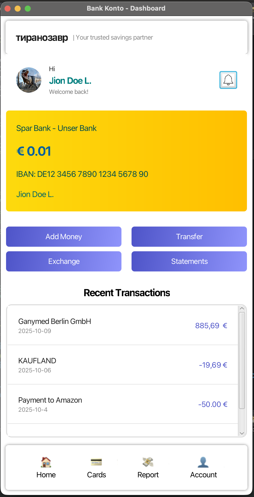
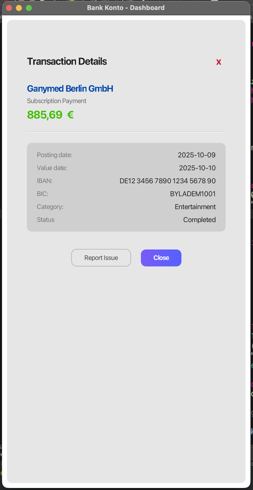

# 💳 Bank Konto

A modern Bank Account Management application built with JavaFX.  
Early development stage — focusing on UI design and application flow.

## Table of Contents
- [Overview](#overview)
- [Current Progress](#current-progress)
- [Project Structure](#project-structure)
- [Technologies](#technologies)
- [How to run](#how-to-run)
- [Future Goals](#future-goals)
- [License](#license)

## Overview
The Bank Konto project models a banking application with a focus on a clean UI and extendable architecture. The goal is a fully interactive system featuring transactions, profiles, statements, and dashboards.

## Current Progress
- Dashboard UI implemented using FXML and CSS  
- Sample transactions populated for layout/testing  
- MVC structure established for scalability

## Project Structure
```
Bank_Konto/
├── src/
│   ├── com.bankapp/
│   │   └── KontoMain.java
│   ├── com.bankapp.controllers/
│   │   └── DashboardController.java
│   └── com.bankapp.models/
│       └── Transaction.java
├── resources/
│   ├── css/
│   │   ├── dashboard.css
│   │   └── transactionPane.css
│   ├── fxml/
│   │   └── dashboard.fxml
│   ├── img/
│   └── screenshots/
│       ├── initial_preview.png
│       └── transactions_details.png
└── README.md
```

## Previews

|  |  |
|---|---|
| _Initial dashboard/homepage preview._ | _Transaction details screenshot._ |

## Technologies
- JavaFX  
- FXML  
- CSS  
- MVC architecture

## How to run
1. Open the project in your IDE (Eclipse, IntelliJ, etc.).  
2. Ensure JavaFX is configured on the classpath (or use a JavaFX-enabled SDK).  
3. Run `KontoMain.java`.

## Future Goals
- Live transaction history and persistence  
- Authentication and profile management  
- Card details and account summaries  
- Exportable/downloadable bank statements  
- Interactive charts and analytics dashboard

## License
This repository is under development. Add a license file (e.g., MIT) when ready.
